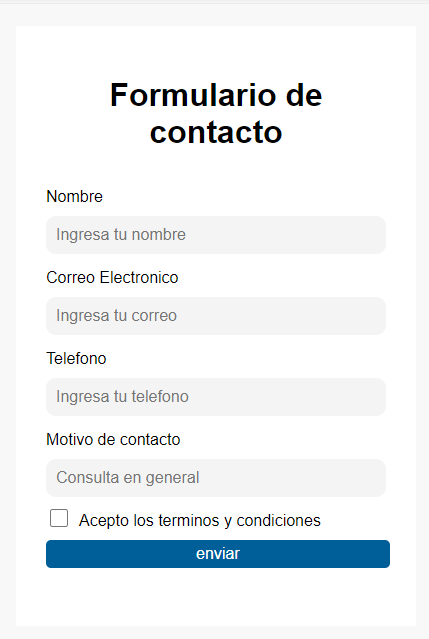

# 🌟 Formulario de Contacto con HTML y CSS

¡Hola! 👋 Estoy muy emocionada de compartir mi primer proyecto como estudiante de programación: un formulario de contacto diseñado con HTML y CSS. Este proyecto me permitió reforzar mis habilidades en el desarrollo web y dar mis primeros pasos en el manejo de GitHub.

---

## 📝 Descripción del Proyecto
Este formulario de contacto es un ejercicio práctico de maquetación web, donde trabajé en la estructura HTML y el diseño CSS para crear una interfaz amigable y atractiva. El objetivo fue replicar un modelo de referencia, prestando atención a los detalles de diseño y la responsividad.

📸 **Vista previa del formulario:**



---

## 🚀 Tecnologías Utilizadas
- **HTML5** 🧱: Para la estructura del formulario.
- **CSS3** 🎨: Para el diseño y la presentación visual.
- **GitHub** 🌐: Para el versionado y almacenamiento del proyecto.

---

## 🛠 Cómo Usar Este Proyecto

1. **Clona el repositorio:**
   ```bash
   git clone <URL_DEL_REPOSITORIO>
   ```

2. **Navega al directorio del proyecto:**
   ```bash
   cd nombre-del-repositorio
   ```

3. **Abre el archivo `index.html` en tu navegador:**

4. **Explora el diseño y la funcionalidad del formulario.**

---

## 💡 Aprendizajes y Retos
- Uso de `flexbox` para el diseño responsivo.
- Aplicación de estilos como `box-shadow` y `border-radius`.
- Organización de archivos y buenas prácticas con Git y GitHub.

---

## 🌱 Sobre Mí
Soy cocinera, mamá y futura programadora. Cada momento libre lo dedico a aprender y crecer en este mundo de la tecnología, con el sueño de convertirme en una desarrolladora exitosa. 💻❤️

---

## 🔗 Enlaces

- **Conéctate conmigo en LinkedIn:** [Tu perfil de LinkedIn](https://www.linkedin.com/in/teresa-llobell-7080b52bb/)

¡Gracias por visitar mi proyecto! 🚀


