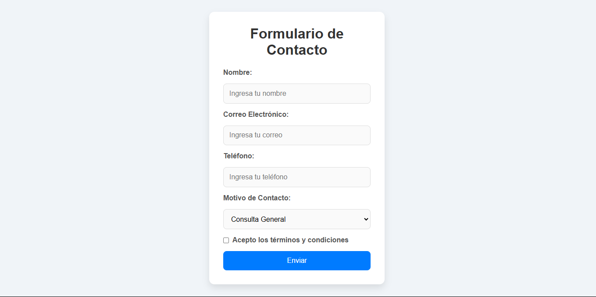

# **Tarea: Formulario con HTML y CSS**

### **Descripción**
Tu tarea es completar el diseño de un formulario utilizando HTML y CSS para que se asemeje lo más posible a la siguiente imagen:



Este ejercicio está pensado para que mejores tus habilidades en diseño y maquetación web.

---

### **Instrucciones:**

1. **Clona el repositorio:**
   ```bash
   git clone <URL_DEL_REPOSITORIO>
   ```

2. **Crea una nueva rama con tu nombre:**
   ```bash
   git checkout -b tu-nombre
   ```

3. **Crea los archivos `index.html` y `styles.css`:**
   - Realiza los cambios necesarios para que el diseño del formulario coincida con la imagen proporcionada.

4. **Guarda tus cambios y haz un commit:**
   ```bash
   git add .
   git commit -m "Ajustes al diseño del formulario"
   ```

5. **Sube tu rama al repositorio remoto:**
   ```bash
   git push origin tu-nombre
   ```

6. **Abre un Pull Request:**
   - Ve al repositorio en GitHub.
   - Haz clic en "Compare & pull request".
   - Agrega una descripción breve de tus cambios.
   - Envía el Pull Request para revisión.

---

### **Puntos Clave:**
- Usa propiedades de CSS como `flexbox`, `box-shadow`, y `border-radius`.
- Asegúrate de que el formulario sea responsivo.
- Presta atención a los detalles del diseño: colores, alineaciones y tipografía.

---

### **Nota:**
En el repositorio hay una rama llamada `terminado-by-gonza` donde encontrarás el código ya completado. Puedes usarla como referencia una vez que hayas terminado tu propia versión.

